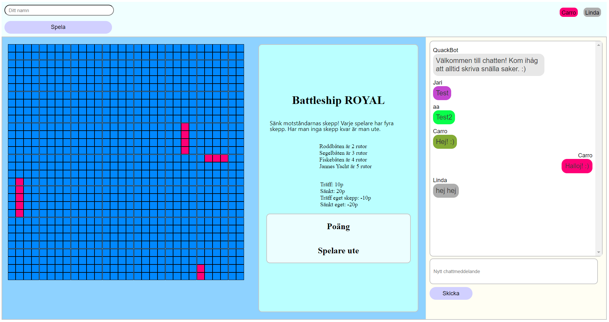
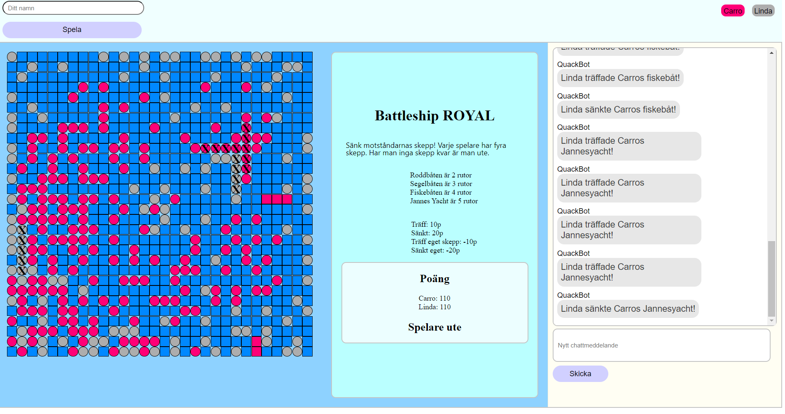
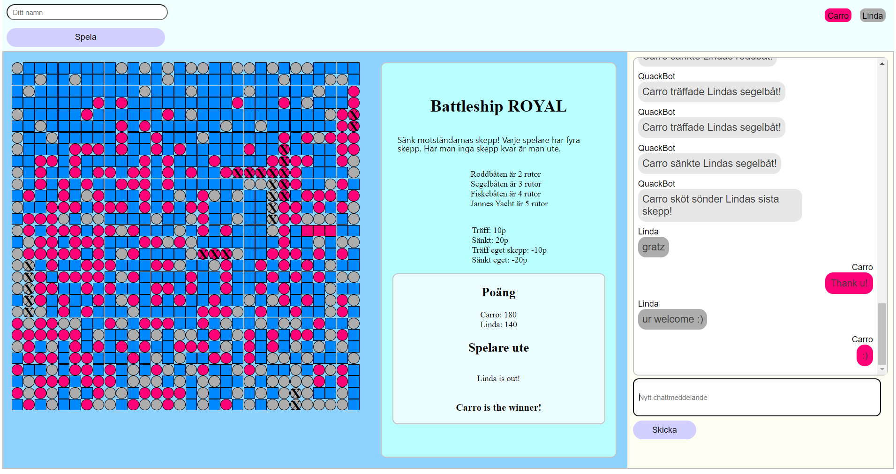

# GROUP ASSIGNMENT - SOCKET IO
Course: API

### Start project
- cd client
- cd vite-project
- npm i
- npm run dev

## SCREENSHOTS

## WHAT WE USED
- HTML
- CSS/SASS
- Flexbox
- JavaScript
- Vite
- Node js
- Mongo Atlas
- Socket io 
- Digital Ocean

## ABOUT THE PROJECT
### Assignment 
You are tasked with building an application where users can play with each other in real-time. Each user will be assigned a color. There should be a chat feature where players can communicate with each other. The application should support saving data to a database. Bonus: The application should be deployed on Digital Ocean.

### The game
- The boats are randomly placed on the game board when the player connects with their name.
- The player is randomly assigned a color.
- There's no waiting for turns; players can shoot at any time. It's a battle royale.
- When hitting a ship, the chat displays who hit which player's ship and what type of ship it was. 
- When the entire ship is hit, it's announced that the ship has been sunk.
- Players earn 10 points for hitting a ship and 20 points when sinking the entire ship.
- Players lose points if they shoot their own boat.
- Players cannot see each other's boats. 
- The opponent's boat gets an X when hit.
- When the game ends, it's announced which player has won.
- If a player loses all their boats, they are out. That player cannot shoot anymore.
- The chat messages are saved in the database.

## AUTHOR
Caroline Vårsaga, Jari Leminaho, Linda Leminaho -2024
 Studying "Front End Developer" at Medieinstituet

GitHub: 
- https://github.com/CarolineVarsaga
- https://github.com/JariPii
- https://github.com/Zileena6

LinkedIn: https://www.linkedin.com/in/caroline-varsaga
